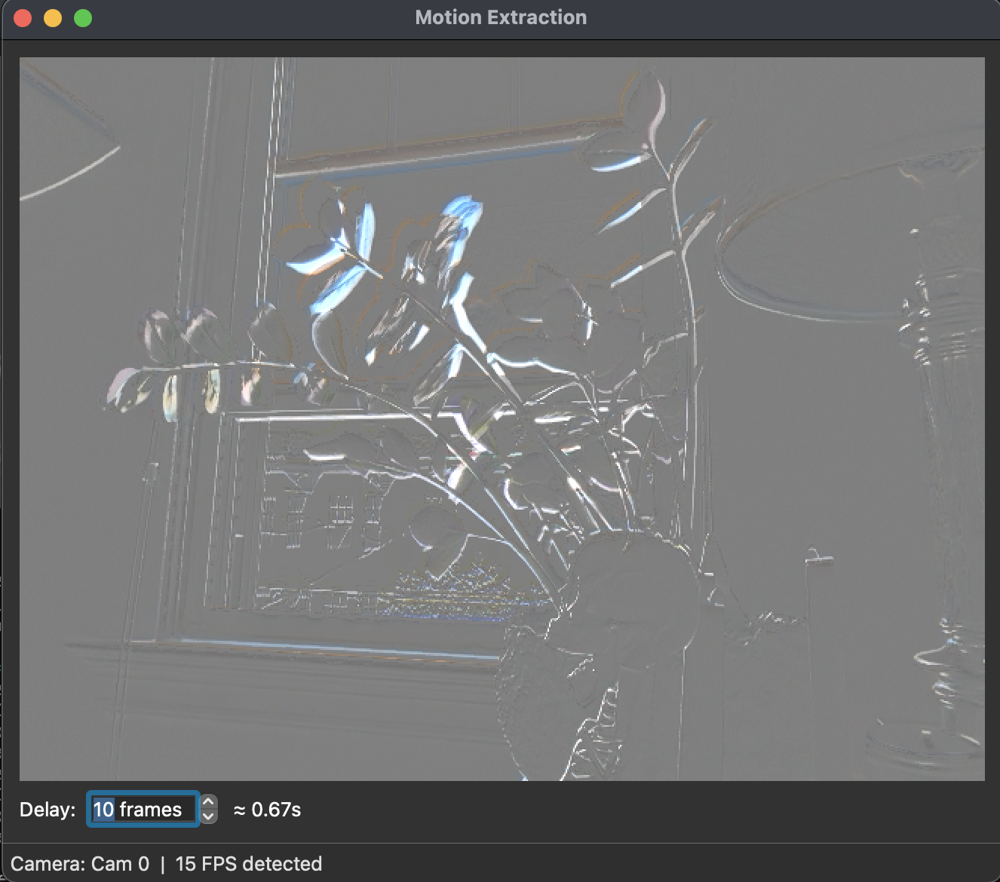

# Motion Extractor

Real-time motion extraction from live camera streams using OpenCV - isolates moving objects by removing static background elements through frame differencing.



## Quick Start

```bash
# 1. Clone and navigate
git clone https://github.com/daliudzius/motion-extractor.git
cd motion-extractor

# 2. Set up environment
python -m venv .venv
source .venv/bin/activate  # Windows: .venv\Scripts\activate

# 3. Install dependencies
pip install -r requirements.txt

# 4. Run the PyQt window
python src/qt_main.py
```

## Controls

- **Delay Spinbox** – Click to type a value or drag arrows to adjust frame delay (0-10 seconds)
- **Mouse Scroll / Arrow Keys** – Fine-tune delay when the spinbox is focused
- **Esc / Ctrl+Q** – Quit the application

The application opens a single window that combines the video preview and controls.

## Features

- Live camera processing with adjustable delay (0-10 seconds)
- Real-time motion visualization through frame blending
- On-screen overlay with live delay info
- Status bar with camera name and detected FPS
- Configurable via `config/settings.json`

## How It Works

Compares current frame with a delayed frame from buffer, applies differencing and blending at 50% opacity to highlight only pixels that changed over time.

## Development

```bash
pytest              # Run tests
```

## License

MIT
